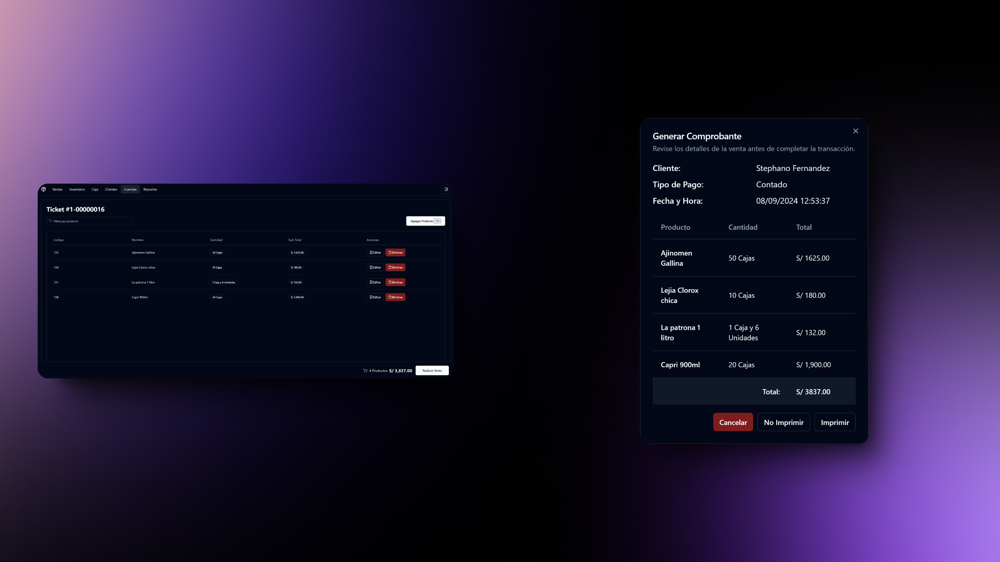

# 🛒 Proyecto Freelance FullStack: Sistema de Punto de Venta Personalizado

> **IMPORTANTE**: Versión pre-alpha actualmente en desarrollo. Este sistema está diseñado exclusivamente para uso interno y control en el negocio. No está destinado ni certificado para cumplir con los requisitos específicos de facturación electrónica o reportes fiscales exigidos por SUNAT (Superintendencia Nacional de Aduanas y de Administración Tributaria)





## 📖 Descripción

Es un sistema de punto de venta moderno, eficiente, personalizado, diseñado para optimizar las operaciones de ventas para tiendas dedicadas a la venta de abarrotes por mayor y menor. Esta solución combina una interfaz intuitiva con potentes funcionalidades para mejorar la experiencia tanto de los empleados como de los clientes.

## ✨ Características principales

- 🖥️ **Interfaz intuitiva**: Diseño fácil de usar que minimiza el tiempo de entrenamiento.
- 📊 **Gestión de inventario**: Control en tiempo real del stock y alertas automáticas.
- 👥 **Gestión de clientes**: Sistema de fidelización y seguimiento de historial de compras.
- 📈 **Reportes y análisis**: Generación de informes detallados para toma de decisiones.
- 🔄 **Sincronización en la nube**: Acceso a datos desde múltiples dispositivos y ubicaciones.
- 💼 **Gestión de caja**: 
  - Control de inicio y cierre de caja.
  - Generación automática de reportes diarios enviados al propietario.
- 📑 **Control de cuentas por pagar**: 
  - Seguimiento de facturas y boletas pendientes de pago.
  - Ejemplo: Registro y control de pedidos grandes de mercaderia aún no pagadas.
- 📩 **Reportes automáticos**: Envío de resumen diario al propietario con detalles de ventas, inventario y finanzas.


## 💻 Tecnologías Utilizadas
```js
const technologies = [
  { name: "React"},
  { name: "NestJS"},
  { name: "PostgreSQL"},
]
```
Hecho por [Stephano Fernandez](https://www.linkedin.com/in/stephano-fernandez/) 💼
